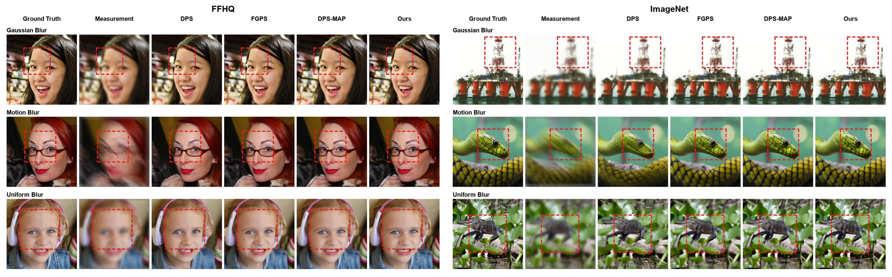

# Frequency-Decoupled Diffusion Guidance for Non-Blind Image Deblurring

Official project page for the paper **Frequency-Decoupled Diffusion Guidance for Non-Blind Image Deblurring**.

Sihan Wang1,† · Jinshu Huang1,†,* · Haibin Su2 · Yunhua Xue1

1 School of Mathematical Sciences, Nankai University, Tianjin, China 
2 Yau Mathematical Sciences Center, Tsinghua University, Beijing, China 
† Equal contribution. * Corresponding author.

## Links

- Paper: arXiv coming soon
- Code: being prepared
- Supplementary material: included with the paper

## TL;DR

We study training-free non-blind image deblurring with pretrained diffusion models. The guidance separates progressive frequency activation from degradation-dependent attenuation, combining an active-frequency schedule with attenuation-aware spectral regularization and trajectory stabilization. Uniform deblurring additionally uses a CGJ correction.

  

  Representative qualitative comparisons on FFHQ and ImageNet under Gaussian, motion, and uniform deblurring.

## Overview

Existing frequency-aware guidance methods mainly control when frequency components enter measurement consistency. Frequencies at similar spatial scales, however, can be attenuated very differently by different blur kernels. Our method explicitly separates **frequency activation** from **degradation-induced attenuation** without assuming that prior methods ignore either effect.

## Method

### Frequency activation

The active band expands from low to high frequencies over reverse diffusion:

$$
G_t(\omega) = \mathbf{1}_{\lVert\omega\rVert_2 < \tau_t}.
$$

Here, $\tau_t$ controls when each frequency enters measurement-consistency guidance.

### Attenuation-aware spectral regularization

For blur kernel $\kappa$, we define

$$
W_{\kappa}(\omega) = \frac{\rho}{|\widehat{\kappa}(\omega)|^2 + \rho},
\qquad
M_t(\omega) = \bigl(1-G_t(\omega)\bigr)W_{\kappa}(\omega).
$$

$G_t$ controls *when* a frequency becomes active; $W_{\kappa}$ reflects how strongly that frequency is attenuated by the degradation. The combined mask $M_t$ applies attenuation-aware weighting only to frequencies outside the active band.

### Trajectory stabilization

A local trajectory regularizer, $\mathrm{TV}_{\mathrm{ani}}\!\left(x_t-\operatorname{sg}(\hat{x}_{0,t})\right)$, controls spatial irregularity in the deviation between the current state and its clean-image estimate. It is not ordinary total-variation regularization applied directly to the reconstruction.

### Operator-specific CGJ correction

Uniform deblurring additionally combines measurement-space conjugate-gradient refinement with Jacobian-guided propagation. This CGJ correction is applied to the **CGJ-DDPM** branch only; it is not a component shared by all degradation tasks.

## Two-Branch Inference

Gaussian and motion deblurring each run independent DDPM and DDIM branches. Uniform deblurring runs independent CGJ-DDPM and DDIM branches. Each branch completes its own reverse process before the two reconstructions are combined by fixed-weight **output-space fusion**; no mid-trajectory fusion is used.

## Main Results

Across the six dataset-task settings, the method achieves the best PSNR in four cases and the best SSIM in five cases, while ranking second in the remaining settings.

| Dataset | Deblurring task | Ours PSNR ↑ | Ours SSIM ↑ |
| --- | --- | ---: | ---: |
| FFHQ | Gaussian | 29.528 | 0.842 |
| FFHQ | Motion | 29.447 | 0.839 |
| FFHQ | Uniform | 29.160 | 0.827 |
| ImageNet | Gaussian | 25.500 | 0.725 |
| ImageNet | Motion | 26.415 | 0.763 |
| ImageNet | Uniform | 25.869 | 0.724 |

Ours has the best PSNR and SSIM on all three FFHQ tasks and on ImageNet Gaussian deblurring. On ImageNet motion deblurring, it ranks second in both PSNR and SSIM. On ImageNet uniform deblurring, its PSNR is 0.016 dB below the best result, while its SSIM is the best.

### Stronger-noise robustness

At $\sigma_y=0.10$ on FFHQ, Ours obtains 28.720 / 0.8198 for Gaussian, 27.536 / 0.7907 for motion, and 27.797 / 0.7918 for uniform deblurring (PSNR / SSIM). It achieves the best PSNR and SSIM in all three of these stronger-noise settings.

## Additional Analysis

The supplementary material includes complete component ablations; attenuation-weighting, frequency-scheduling, trajectory-regularization, and CGJ ablations; two-branch inference and paired statistical analyses; sensitivity to $\rho$ and spectral-prior strength; LPIPS and FID comparisons; absolute reconstruction-error and frequency-mask visualizations; and computational cost.

## Code

The implementation and reproducibility materials are currently being organized for release in this repository.

The planned release will include frequency-decoupled guidance, task-specific configurations, operator-specific CGJ correction, evaluation utilities, data and checkpoint setup instructions, and reproduction instructions. The method is training-free and does not require task-specific training.

## External Resources

The FFHQ pretrained checkpoint is distributed with the DPS release. The ImageNet 256 × 256 class-conditional checkpoint comes from Guided Diffusion. The experiments also use or reference public implementations including DPS, FGPS, and DPS-MAP. Those external implementations and pretrained checkpoints are not claimed as code or assets of this repository and are not included here.

## Citation

BibTeX will be added once the arXiv identifier is available.

## Acknowledgements

This work was supported by the National Natural Science Foundation of China under Grant 12531011.

The authors thank the Chern Institute of Mathematics, Nankai University, for its hospitality and support during the corresponding author's visit, during which part of this work was carried out.

We thank Ji Li for kindly providing the DPS-MAP implementation used in our experiments. We also thank the authors of the open-source implementations used in this work for making their code publicly available.

## Contact

- Sihan Wang: wangsihan@mail.nankai.edu.cn
- Jinshu Huang (corresponding author): huangjsh@mail.nankai.edu.cn
